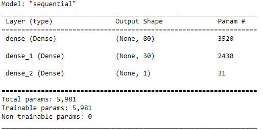

# Neural Network Charity Analysis

## Overview of Analysis
Uses a deep neural network to predict whether or not an organization that applies for charity funding will be successful with their cause. The dataset being examined is fairly large with over 34,000 organizations with many features. First preprocessing steps including dropping the dataset only to relevant rows, binning data in columns where there are many unique values, encoding categorical columns, splitting the data into training and validation sets, and then scaling the data are performed. The neural network is constructed using the Tensorflow Keras library and the results are evaluated using the loss and accuracy metrics.

## Results

### Data Preprocessing

* The target is the IS_SUCCESSFUL column, a binary classification
* The features are:
    * APPLICATION_TYPE
    * AFFILIATION
    * CLASSIFICATION
    * USE_CASE
    * ORGANIZATION
    * STATUS
    * INCOME_AMT
    * SPECIAL_CONSIDERATIONS
    * ASK_AMT
* The following columns are neither the target nor features:
    * EIN
    * NAME

### Compiling, Training, and Evaluating the Model

For the neural network, the following hyperparameters were selected:
* Hidden layer using 80 neurons and the ReLU activation function
* Hidden layer using 50 neurons and the RELU activation function
* Output layer with the Sigmoid activation function

This structure was arrived at based on the number of features after encoding: 45. Selecting around 2 to 3 times the number of features is usually a good starting place for a neural network, and due to the complexity of the data a simple neural network was deemed insufficient resulting in another hidden layer. The ReLU activation function was used as it is typically more efficient than other options such as the Tanh function that generally produces better results.

To attempt to get better performance various tweaking of the model was performed, but ultimately the final results were at best on par with the initial model and in the case of removing very extreme outliers worse. The optimizations include:
1. Checking outliers in the ASK_AMT column, attempting to remove the extreme values.
2. First the STATUS, a column that only denotes if the organization is still active was removed as it shouldn't relate to if the organization was successful with funding. Additionally the CLASSIFICATION column was removed in another attempt, as this column denotes the government classification of the organization which is only a more complicated version of the information the ORGANIZATION column contains.
3. Decreasing the values in the binning.
4. Widening the neural network by adding more neurons to layers.
5. Deepening the neural network by adding an additional 2 layers.
6. Trying the Tanh activation function on the hidden layers.
7. Adding to the number of epochs when fitting the model to training data.

## Summary

Overall the model produced achieved a 72.9% accuracy when evaluated with the testing data; an attempt at optimization that implemented 2 additional layers achieved 73.0% accuracy, but a 0.1% increase in accuracy is barely an improvement to warrant the increase in the complexity of the network and longer runtime. Ultimately the neural network model failed to achieve an acceptable level of accuracy at predicting the success when an organization is funded by the charity.

Another machine learning model that could handle this dataset are Support Vector Machines. SVMs are suitable for binary classification problems, and here the target column IS_SUCCESSFUL is a binary output. Compared to neural networks SVMs are less prone to overfitting and can potentially outperform a neural network. The one caveat is that the data has high-dimensionality which is an area where a neural network tends to have more success, but the dimensionality of the data can be reduced by dropping the columns mentioned during the optimization process.
